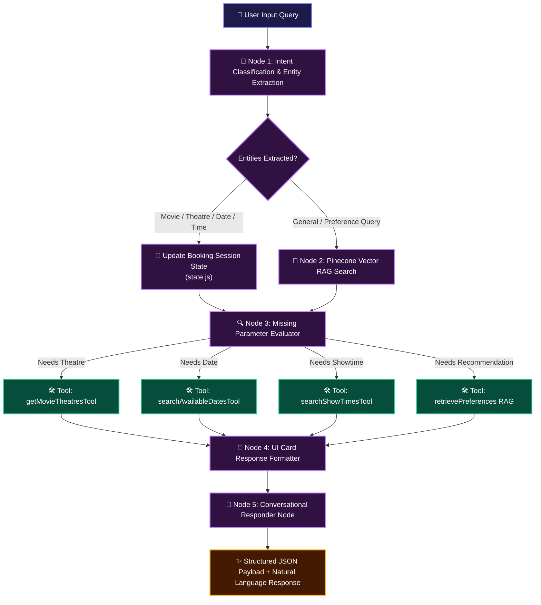
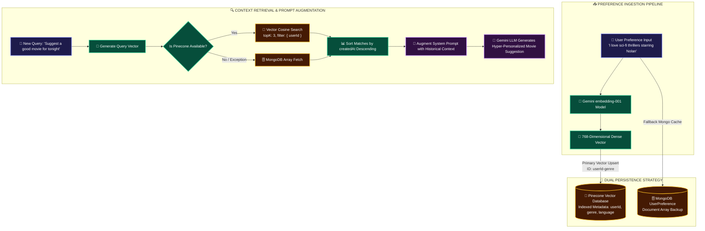

<div align="center">

# 🎬 CineVerse

### *Production-Grade AI-Powered Movie Ticket Booking Platform*

[](https://github.com/ishaansharma23/cineVerse/actions/workflows/docker.yml)
[](https://hub.docker.com/r/ishaansharma23/cineverse-backend)
[](https://hub.docker.com/r/ishaansharma23/cineverse-frontend)
[](https://nodejs.org/)
[](https://expressjs.com/)
[](https://react.dev/)
[](https://www.mongodb.com/)
[](https://redis.io/)
[](https://www.langchain.com/)
[](https://www.pinecone.io/)
[](https://opensource.org/licenses/ISC)

---

**CineVerse** is a modern, enterprise-ready movie ticket booking platform built with the **MERN** stack (MongoDB, Express, React 19, Node.js). Designed with production principles at its core, CineVerse features a **LangChain & LangGraph-orchestrated AI Movie Booking Agent**, distributed **Redis seat concurrency locks**, **RAG-based personalized recommendations**, **Razorpay payment automation**, real-time **Socket.IO** updates, and full **Dockerized CI/CD automation**.

[Explore Features](#-features) • [System Architecture](#-system-architecture) • [AI Agent Architecture](#-ai-agent-architecture) • [Docker Setup](#-docker-setup) • [CI Pipeline](#-github-actions-ci-pipeline)

</div>

---

## 📌 Table of Contents

- [🎬 CineVerse](#-cineverse)
    - [*Production-Grade AI-Powered Movie Ticket Booking Platform*](#production-grade-ai-powered-movie-ticket-booking-platform)
  - [📌 Table of Contents](#-table-of-contents)
  - [📖 Project Overview](#-project-overview)
  - [✨ Key Features](#-key-features)
  - [💻 Tech Stack](#-tech-stack)
  - [🏗️ System Architecture](#️-system-architecture)
  - [🤖 AI Agent Architecture](#-ai-agent-architecture)
  - [🔐 Authentication Flow](#-authentication-flow)
  - [🎟️ Seat Booking Flow](#️-seat-booking-flow)
  - [⚡ Redis Seat Locking Mechanism](#-redis-seat-locking-mechanism)
  - [🧠 Retrieval-Augmented Generation (RAG) Architecture](#-retrieval-augmented-generation-rag-architecture)
  - [📂 Folder Structure](#-folder-structure)
  - [🗄️ Database Collections](#️-database-collections)
  - [🚀 Installation Guide](#-installation-guide)
  - [🔑 Environment Variables](#-environment-variables)
  - [🐳 Docker Setup](#-docker-setup)
  - [🚢 Docker Compose Development](#-docker-compose-development)
  - [🔄 GitHub Actions CI Pipeline](#-github-actions-ci-pipeline)
  - [🌐 API Modules](#-api-modules)
  - [🛡️ Security Architecture](#️-security-architecture)
  - [🚀 Performance Optimizations](#-performance-optimizations)
  - [🔮 Future Enhancements](#-future-enhancements)
  - [📸 Screenshots](#-screenshots)
  - [📹 Demo](#-demo)
  - [👥 Contributors](#-contributors)
  - [📄 License](#-license)
  - [📬 Contact](#-contact)

---

## 📖 Project Overview

CineVerse reimagines movie ticketing by combining robust distributed backend services with an **autonomous AI Booking Agent**. Unlike static ticketing portals or simple conversational chatbots, CineVerse implements an agentic workflow that executes backend database tools, maintains session state, handles seat locking, and assists users across multi-step transactions.

The platform provides fine-grained governance through **Role-Based Access Control (RBAC)** across three distinct user roles:

```
                          ┌─────────────────────────┐
                          │   CineVerse Platform    │
                          └────────────┬────────────┘
                                       │
        ┌──────────────────────────────┼──────────────────────────────┐
        ▼                              ▼                              ▼
 ┌─────────────┐               ┌──────────────┐               ┌──────────────┐
 │    User     │               │ Theatre Owner│               │    Admin     │
 └──────┬──────┘               └──────┬───────┘               └──────┬───────┘
        │                             │                              │
        ├─ Search Movies              ├─ Add/Manage Theatres         ├─ Approve Theatres
        ├─ AI Booking Agent           ├─ Add Screens & Seats Layout  ├─ Approve Show Proposals
        ├─ Interactive Seat Map       ├─ Propose Show Schedules      ├─ Platform Analytics
        ├─ Razorpay Checkout          ├─ Dynamic Price Multipliers   ├─ Dynamic Price Config
        └─ Digital Ticket (PDF & QR)  └─ Revenue Dashboard           └─ User Management
```

- **User**: Search movies (TMDB synced), chat with the AI agent to discover and select shows, select seats interactively, pay securely via Razorpay, and download PDF tickets containing verified QR codes.
- **Theatre Owner**: Manage theatre properties, design custom screen layout grids (Standard, VIP, Executive seats), submit show scheduling proposals to Admins, and view theatre revenue analytics.
- **Admin**: Approve or reject theatre registration proposals and show schedules, manage platform-wide pricing configurations (base rates, weekend multipliers, peak hour taxes), and inspect full system activity.

---

## ✨ Key Features

- **🤖 AI Movie Booking Agent (Not a Chatbot)**: Multi-step autonomous agent built using **LangGraph** & **LangChain** that performs intent classification, entity extraction, backend tool calling, session state tracking, and direct seat selection redirection.
- **🔒 Race-Condition Free Seat Locking**: High-concurrency seat locking engine using **Redis** with atomic `SET NX EX` commands (5-minute TTL expiration) and non-blocking `SCAN` iteration to guarantee zero double-bookings.
- **🧠 Vector RAG & Preference Memory**: Hybrid memory store utilizing **Pinecone Vector Database** for semantic preference similarity search (`embedding-001`), paired with **MongoDB** fallback storage for structured preference persistence.
- **💳 Razorpay Payment Integration**: End-to-end payment lifecycle handling order creation, signature verification using HMAC-SHA256, automatic seat confirmation, and refund processing on cancellations.
- **📲 PDF Ticket & QR Code Generation**: Server-side generation of downloadable digital tickets formatted with `pdfkit` and embedded `qrcode` data for on-site scanning.
- **🔄 TMDB Automated Synchronization**: Server background cron job (`node-cron`) periodically fetching latest releases, trending films, cast details, and backdrop artwork from the **TMDB API**.
- **⚡ Real-Time Socket.IO Synchronization**: WebSocket channels broadcasting instant seat selection state changes and show updates to connected clients.
- **🐳 Full Docker & CI Engine**: Complete containerization with multi-stage Dockerfiles, Docker Compose dev profiles, and automated **GitHub Actions CI** pushing multi-architecture images to Docker Hub.

---

## 💻 Tech Stack

### Frontend

| Technology | Purpose | Description |
| :--- | :--- | :--- |
| **React 19** | UI Library | Component-driven declarative web interface |
| **Vite** | Build Tool | Lightning-fast module bundler & dev server |
| **Redux Toolkit** | State Management | Centralized global application state |
| **TailwindCSS v4** | Styling Framework | Utility-first responsive dark-mode styling system |
| **Framer Motion** | Animations | Complex UI page transitions and micro-interactions |
| **GSAP** | Animations | High-performance hero canvas animations |
| **Socket.IO Client** | WebSockets | Real-time seat occupation sync |
| **Lucide React** | Icons | Modern icon set for component UI |

### Backend

| Technology | Purpose | Description |
| :--- | :--- | :--- |
| **Node.js** | Runtime Environment | Asynchronous event-driven server runtime |
| **Express.js v5** | Web Framework | REST API route management & middleware execution |
| **MongoDB / Mongoose v9** | Database / ORM | Document storage for users, shows, theatres, & bookings |
| **Redis v6+** | Cache & Lock Manager | Memory store for 5-minute atomic seat locks & sessions |
| **Socket.IO** | WebSocket Server | Bi-directional event communication for live seat maps |
| **PDFKit & QRCode** | Asset Generation | Server-side ticket PDF creation with embedded QR vectors |
| **Nodemailer** | Mail Service | Automated booking confirmation email delivery |
| **Node-Cron** | Task Scheduler | Background TMDB movie sync & expired lock cleanup |

### AI & Vector Database

| Technology | Purpose | Description |
| :--- | :--- | :--- |
| **LangChain** | AI Framework | LLM tooling orchestration & chain management |
| **LangGraph** | Agentic Workflow | Directed Acyclic Graph (DAG) state nodes for agent |
| **Google Gemini 2.5** | LLM Engine | Intent classification, entity extraction & response generation |
| **Pinecone** | Vector Database | High-performance similarity search for user RAG embeddings |
| **Google GenAI Embeddings** | Vector Embeddings | `embedding-001` model for text vectorization |

### DevOps & Infrastructure

| Technology | Purpose | Description |
| :--- | :--- | :--- |
| **Docker** | Containerization | Isolated application runtime environments |
| **Docker Compose** | Orchestration | Multi-container environment configuration |
| **GitHub Actions** | CI Engine | Automated build and push workflow on git push |
| **Docker Hub** | Image Registry | Container repository (`ishaansharma23/cineverse-*`) |

---

## 🏗️ System Architecture

```mermaid
flowchart TB
    %% Custom Theme Class Definitions
    classDef clientStyle fill:#1e1b4b,stroke:#818cf8,stroke-width:2px,color:#fff
    classDef gatewayStyle fill:#064e3b,stroke:#34d399,stroke-width:2px,color:#fff
    classDef serviceStyle fill:#1e293b,stroke:#38bdf8,stroke-width:2px,color:#fff
    classDef aiStyle fill:#311042,stroke:#c084fc,stroke-width:2px,color:#fff
    classDef dbStyle fill:#451a03,stroke:#fbbf24,stroke-width:2px,color:#fff
    classDef extStyle fill:#27272a,stroke:#a1a1aa,stroke-width:2px,color:#fff

    subgraph CLIENT_TIER ["📱 CLIENT TIER (REACT SPA & WEBSOCKETS)"]
        UI["💻 React 19 SPA (Redux Toolkit + Tailwind v4)"]:::clientStyle
        WS_CLIENT["⚡ Socket.IO Web Event Client"]:::clientStyle
    end

    subgraph SECURITY_GATEWAY ["🛡️ API GATEWAY & SECURITY LAYER"]
        AUTH_MW["🔑 JWT Cookie Authentication Middleware"]:::gatewayStyle
        RBAC_MW["🔒 Role-Based Access Control Guard (RBAC)"]:::gatewayStyle
        RATE_LIMIT["⚡ Express Rate Limiter Middleware"]:::gatewayStyle
    end

    subgraph CORE_SERVICES ["⚙️ CORE BACKEND MICRO-SERVICES"]
        BOOKING_SVC["🎟️ Booking & Seat Management Controller"]:::serviceStyle
        AI_SVC["🤖 LangGraph AI Booking Agent Engine"]:::aiStyle
        PAYMENT_SVC["💳 Razorpay Payment & Webhook Service"]:::serviceStyle
        SYNC_SVC["🔄 TMDB Auto-Sync Cron Job"]:::serviceStyle
        TICKET_SVC["📄 PDFKit & QR Code Generator"]:::serviceStyle
    end

    subgraph INFRASTRUCTURE ["💾 PERSISTENCE & DISTRIBUTED CACHE"]
        MONGO[("🗄️ MongoDB Primary Storage<br/>(Users, Movies, Shows, Bookings)")]:::dbStyle
        REDIS[("⚡ Redis In-Memory Store<br/>(5-Min Atomic Seat Locks)")]:::dbStyle
        PINECONE[("🌲 Pinecone Vector DB<br/>(User RAG Preference Embeddings)")]:::dbStyle
        WS_SERVER["📡 Socket.IO Server Engine<br/>(Real-Time Room Broadcasting)"]:::serviceStyle
    end

    subgraph EXTERNAL_APIS ["🌐 EXTERNAL THIRD-PARTY SERVICES"]
        GEMINI["🧠 Google Gemini 2.5 LLM"]:::extStyle
        RAZORPAY["💳 Razorpay Payment Gateway API"]:::extStyle
        TMDB["🎬 TMDB API v3"]:::extStyle
    end

    %% Flow Connections
    UI -->|HTTP / REST API| AUTH_MW
    UI <-->|WebSocket Stream| WS_CLIENT
    WS_CLIENT <-->|Live Seat Status Sync| WS_SERVER

    AUTH_MW --> RBAC_MW --> RATE_LIMIT
    RATE_LIMIT --> BOOKING_SVC
    RATE_LIMIT --> AI_SVC
    RATE_LIMIT --> PAYMENT_SVC

    BOOKING_SVC <-->|Atomic SET NX EX Lock| REDIS
    BOOKING_SVC <-->|Read / Write Bookings| MONGO
    BOOKING_SVC -->|Generate Ticket| TICKET_SVC

    AI_SVC <-->|Intent & Tool Calling| GEMINI
    AI_SVC <-->|Vector Cosine Search| PINECONE
    AI_SVC <-->|Structured Preference Cache| MONGO

    PAYMENT_SVC <-->|Order & Signature Verification| RAZORPAY
    PAYMENT_SVC <-->|Update Payment Status| MONGO

    SYNC_SVC <-->|Automated Cron Fetch| TMDB
    SYNC_SVC -->|Upsert Movies| MONGO
```



---

## 🤖 AI Agent Architecture

CineVerse features an **AI Movie Booking Agent**, powered by **LangGraph** and **LangChain**. Rather than responding with static chat text, the agent maintains an explicit session state, executes deterministic backend tools to query MongoDB, and leads the user through a multi-step booking funnel.



### Agent Capability Breakdown

1. **Intent Detection**: Classifies whether the user wants to book a ticket, get recommendations, check showtimes, or cancel an existing booking.
2. **Entity Extraction**: Uses structured LLM parsing to extract parameters such as `movieTitle`, `theatreName`, `showDate`, `showTime`, and `seatCount`.
3. **Multi-step Workflow Execution**: Validates missing parameters step-by-step (`SELECT_MOVIE` → `SELECT_THEATRE` → `SELECT_DATE` → `SELECT_SHOWTIME` → `SEAT_RESERVATION`).
4. **Backend Tool Calling (`backendTools.js`)**: Executes database queries to fetch exact scheduled shows rather than allowing the LLM to hallucinate movies or timings.
5. **Session Memory (`state.js`)**: Maintains persistent short-term conversation state across turns.
6. **RAG Vector Memory (`pinecone.js`)**: Vectorized semantic search for long-term user preferences (genres, favorite actors, preferred languages).

---

## 🔐 Authentication Flow

CineVerse uses a secure **JWT-in-HTTP-Only-Cookie** mechanism combined with strict **Role-Based Access Control (RBAC)** middleware.

```mermaid
sequenceDiagram
    autonumber
    
    box rgb(15, 23, 42) Client & Browser
    actor User as 👤 User / Owner / Admin
    participant Client as 💻 React 19 Frontend
    end

    box rgb(30, 41, 59) Security & API Gateway
    participant AuthMW as 🔑 Auth Middleware
    participant RbacMW as 🔒 RBAC Guard
    participant JWT as 🛡️ JWT Signer & Verifier
    end

    box rgb(20, 83, 45) Database & Storage
    participant DB as 🗄️ MongoDB User Store
    end

    rect rgb(15, 23, 42)
    Note over User,DB: Phase 1: Authentication & Token Issuance
    User->>Client: 1. Submit Credentials (Email & Password)
    activate Client
    Client->>AuthMW: 2. POST /api/auth/login { email, password }
    activate AuthMW
    AuthMW->>DB: 3. Query User Document by Email
    activate DB
    DB-->>AuthMW: 4. User Object (with bcrypt hash)
    deactivate DB
    
    AuthMW->>AuthMW: 5. Verify Password via bcrypt.compare()
    
    alt ❌ Invalid Credentials
        AuthMW-->>Client: 401 Unauthorized { error: "Invalid Email/Password" }
        Client-->>User: Display Toast Error Message
    else ✅ Valid Credentials
        AuthMW->>JWT: 6. Sign JWT Payload (userId, role, exp: 7d)
        activate JWT
        JWT-->>AuthMW: Signed Token String
        deactivate JWT
        AuthMW-->>Client: 7. Set-Cookie: token=JWT; HttpOnly; Secure; SameSite=Strict<br/>200 OK { user: { id, name, role } }
        deactivate AuthMW
        Client-->>User: Redirect to Dashboard / Home
    end
    deactivate Client
    end

    rect rgb(30, 41, 59)
    Note over User,DB: Phase 2: Protected Resource Request & RBAC Verification
    User->>Client: 8. Navigate to Protected Route (e.g. /admin/analytics)
    activate Client
    Client->>AuthMW: 9. GET /api/admin/analytics (Cookie automatically attached)
    activate AuthMW
    AuthMW->>AuthMW: 10. Extract token from req.cookies
    AuthMW->>JWT: 11. Verify Signature & Check Expiration
    activate JWT
    
    alt ❌ Token Missing / Expired
        JWT-->>AuthMW: Token Verification Failed
        AuthMW-->>Client: 401 Unauthorized { error: "Session Expired" }
        Client-->>User: Redirect to /login
    else ✅ Token Valid
        JWT-->>AuthMW: Decoded Token { id, role: "admin" }
        deactivate JWT
        AuthMW->>RbacMW: 12. Pass Control to RBAC Guard
        activate RbacMW
        
        alt ❌ Role Unauthorized (e.g. role == "user")
            RbacMW-->>Client: 403 Forbidden { error: "Access Denied" }
        else ✅ Role Authorized (role == "admin")
            RbacMW->>DB: 13. Query Protected Database Records
            activate DB
            DB-->>RbacMW: Data Payload
            deactivate DB
            RbacMW-->>Client: 200 OK { dataPayload }
            deactivate RbacMW
            Client-->>User: Render Dashboard Components
        end
    end
    deactivate AuthMW
    deactivate Client
    end
```

---

## 🎟️ Seat Booking Flow

```mermaid
sequenceDiagram
    autonumber

    box rgb(15, 23, 42) Client & UI
    actor User as 👤 Movie Goer
    participant SPA as 💻 React 19 Seat Map
    end

    box rgb(30, 41, 59) Backend Core & WebSockets
    participant API as ⚙️ Express Booking Controller
    participant WS as ⚡ Socket.IO Engine
    participant PDF as 📄 PDF & QR Service
    end

    box rgb(20, 83, 45) High Concurrency Storage
    participant Redis as ⚡ Redis (5-Min TTL Lock)
    participant DB as 🗄️ MongoDB Database
    end

    box rgb(88, 28, 135) External Payment Gateway
    participant Rzp as 💳 Razorpay API
    end

    rect rgb(15, 23, 42)
    Note over User,DB: Step 1: Distributed Atomic Seat Reservation
    User->>SPA: Select Seats (e.g. A1, A2) & Click "Reserve Seats"
    activate SPA
    SPA->>API: POST /api/bookings/lock-seats { showId: "s123", seats: ["A1","A2"] }
    activate API
    API->>Redis: SET seat:s123:A1 lockData NX EX 300
    activate Redis
    
    alt ❌ Seat Already Locked by Another User
        Redis-->>API: Key Creation Failed (NX returns null)
        API-->>SPA: 400 Bad Request ("Seat A1 locked by another user")
        SPA-->>User: Display Red Seat Warning
    else ✅ Lock Granted Successfully
        Redis-->>API: Key Created (OK)
        deactivate Redis
        API->>WS: Emit 'seatsLocked' { showId: "s123", seats: ["A1","A2"] }
        activate WS
        WS-->>SPA: Broadcast Live Occupation to all clients viewing Show s123
        deactivate WS
        API-->>SPA: 200 OK { lockExpirySeconds: 300 }
        deactivate API
        SPA-->>User: Highlight Yellow Reserved Seats (5-Min Countdown Started)
    end
    deactivate SPA
    end

    rect rgb(30, 41, 59)
    Note over User,Rzp: Step 2: Payment Checkout & Signature Verification
    User->>SPA: Click "Proceed to Pay ₹500"
    activate SPA
    SPA->>API: POST /api/payments/create-order { showId: "s123", seats: ["A1","A2"] }
    activate API
    API->>Rzp: Orders.create({ amount: 50000, currency: "INR" })
    activate Rzp
    Rzp-->>API: { id: "order_998877", amount: 50000 }
    deactivate Rzp
    API-->>SPA: 200 OK { orderId: "order_998877", keyId: "rzp_test_xxx" }
    deactivate API

    SPA->>Rzp: Launch Razorpay Checkout SDK Modal
    activate Rzp
    User->>Rzp: Enter UPI / Card Details & Approve Payment
    Rzp-->>SPA: Return Payment Response { paymentId: "pay_112233", signature: "sig_abc" }
    deactivate Rzp

    SPA->>API: POST /api/payments/verify { orderId, paymentId, signature }
    activate API
    API->>API: Compute HMAC-SHA256(orderId + "|" + paymentId, secret)
    
    alt ❌ Signature Mismatch
        API-->>SPA: 400 Bad Request ("Payment Tampered / Invalid")
    else ✅ Signature Verified
        API->>DB: 1. Create Booking Record (Status: CONFIRMED)
        activate DB
        DB-->>API: Booking Saved
        deactivate DB
        API->>Redis: 2. DEL seat:s123:A1 (Release Redis Lock)
        API->>DB: 3. Update Show Document (Add seats to permanent occupied array)
        API->>PDF: 4. Generate Ticket PDF with QR Code Vector
        activate PDF
        PDF-->>API: Ticket Generated (pdfUrl, qrData)
        deactivate PDF
        API-->>SPA: 200 OK { bookingId: "b77", status: "CONFIRMED", ticketUrl }
        deactivate API
        SPA-->>User: Display Booking Success Modal & Download PDF Button
    end
    deactivate SPA
    end
```



---

## ⚡ Redis Seat Locking Mechanism

Double-booking is one of the toughest challenges in high-concurrency ticketing systems. CineVerse resolves this with a custom **Redis Distributed Lock Engine** (`seatLockService.js`).

### Technical Specification

- **Redis Lock Key Format**: `seat:{showId}:{seatNumber}` (e.g., `seat:66a1f8e2:A5`)
- **Atomic Acquisition**: Uses Redis `SET` command with `NX` (Only set if not exists) and `EX` (Expire time in seconds).
  ```javascript
  const result = await redisClient.set(key, JSON.stringify(seatLockData), {
    NX: true,
    EX: 300, // 5-minute TTL lock
  });
  ```
- **Ownership Verification**: Before releasing or checking a lock, the service parses the stored JSON object (`userId`, `lockedAt`). If the active user matches `userId`, re-entry is granted.
- **Non-blocking Key Iteration**: Instead of using blocking `KEYS *` commands (which stall Redis single-threaded loops in production), CineVerse uses non-blocking **cursor-based scanning** (`SCAN`):
  ```javascript
  const reply = await redisClient.scan(cursor, {
    MATCH: `seat:${showId}:*`,
    COUNT: 100
  });
  ```

---

## 🧠 Retrieval-Augmented Generation (RAG) Architecture

CineVerse utilizes a hybrid memory pipeline for personalized AI recommendations.



- **Pinecone Vector Upsert**: Preferences are stored with unique deterministic keys (`${userId}-${category}`) so updated preferences overwrite outdated vectors automatically.
- **Top-K Vector Query**: When a user requests recommendations, the current query is embedded and matched against Pinecone vectors with a strict `filter: { userId }` clause.


---

## 📂 Folder Structure

```
cineVerse/
├── .github/
│   └── workflows/
│       └── docker.yml               # GitHub Actions CI Workflow
├── backend/
│   ├── agent/                       # LangGraph AI Booking Agent Engine
│   │   ├── rag/
│   │   │   └── pinecone.js          # RAG Vector Store & Retrieval Service
│   │   ├── tools/
│   │   │   └── backendTools.js      # LangChain Tools for Database Queries
│   │   ├── bookingAgent.js          # Agent Parameter Evaluator
│   │   ├── graph.js                 # LangGraph Node Definition & State DAG
│   │   ├── prompts.js               # System Prompts & Intent Parsing Rules
│   │   └── state.js                 # Booking Session State Definition
│   ├── config/                      # Infrastructure Configs
│   │   ├── db.js                    # Mongoose Connection Setup
│   │   ├── razorpay.js              # Razorpay SDK Instance
│   │   ├── redis.js                 # Redis Client Setup
│   │   ├── socket.js                # Socket.IO Server Configuration
│   │   └── tmdb.js                  # TMDB Axios Base Instance
│   ├── controllers/                 # REST API Request Handlers
│   │   ├── aiController.js          # AI Agent Chat & Session Endpoints
│   │   ├── authController.js        # Authentication & Cookie Handlers
│   │   ├── bookingController.js     # Seat Reservation & History Handlers
│   │   ├── movieController.js       # TMDB & Database Movie Queries
│   │   ├── paymentController.js     # Razorpay Order & Webhook Handlers
│   │   ├── screenController.js      # Theatre Screen Layout Management
│   │   ├── showController.js        # Show Schedule Management
│   │   └── theatreController.js     # Theatre Owner Operations
│   ├── jobs/                        # Automated Cron Tasks
│   │   ├── bookingExpiry.job.js     # Stale Booking Cleanup Job
│   │   └── movieSync.job.js         # Daily TMDB API Sync Job
│   ├── middleware/                  # Request Processing Middleware
│   │   ├── authMiddleware.js        # JWT Cookie Validation & RBAC Guard
│   │   └── rateLimitMiddleware.js   # Express Rate Limiter Configuration
│   ├── models/                      # Mongoose Database Schemas
│   │   ├── User.js, Movie.js, Theatre.js, Screen.js, Show.js, bookings.js
│   │   ├── Payment.js, Proposal.js, Offer.js, PricingConfig.js, UserPreference.js
│   ├── routes/                      # Express Route Definitions
│   ├── services/                    # Business Logic Layer
│   │   ├── seatLockService.js       # Redis Atomic Locking Engine
│   │   ├── emailService.js          # Nodemailer Transport Service
│   │   ├── pdfService.js            # PDFKit Ticket Generator
│   │   └── qrService.js             # QR Code Vector Data Service
│   ├── app.js                       # Express App Initialization
│   ├── server.js                    # HTTP Server & Socket.IO Listener
│   └── Dockerfile                   # Backend Docker Build Container
├── frontend/
│   ├── public/                      # Static Assets & Icons
│   ├── src/
│   │   ├── assets/                  # CSS Styles & Images
│   │   ├── components/              # Modular UI Components
│   │   │   ├── ai/                  # AI Buddy Floating Chatbot Components
│   │   │   ├── dashboard/           # Owner & Admin Chart Dashboards
│   │   │   ├── layout/              # Navbar, Footer, Sidebar Controls
│   │   │   └── seat/                # Interactive Screen Seat Grids
│   │   ├── pages/                   # Page Components
│   │   ├── redux/                   # Redux Toolkit Slices & Store
│   │   ├── services/                # Axios API Services
│   │   └── App.jsx                  # React Router Master Routing Table
│   ├── dockerfile                   # Frontend Nginx/Vite Container
│   └── vite.config.js               # Vite Configuration Setup
├── docker-compose.yml               # Local Development Docker Compose Profile
├── docker-compose.ci.yml            # CI Profile for Automated Docker Hub Builds
└── package.json                     # Root Project Manifest
```

---

## 🗄️ Database Collections

| Collection | Key Fields | Purpose |
| :--- | :--- | :--- |
| **`User`** | `name`, `email`, `password`, `role` (`user` \| `owner` \| `admin`), `isApproved` | User account authentication & authorization |
| **`Theatre`** | `name`, `location`, `ownerId`, `screens`, `status`, `isApproved` | Registered theatre properties |
| **`Screen`** | `name`, `theatreId`, `seatLayout` (rows, cols, types), `totalSeats` | Screen geometry and layout configuration |
| **`Movie`** | `tmdbId`, `title`, `overview`, `posterPath`, `backdropPath`, `genre`, `releaseDate` | Synced movie catalogue |
| **`Show`** | `movieId`, `theatreId`, `screenId`, `startTime`, `date`, `price`, `occupiedSeats` | Scheduled movie screenings |
| **`Booking`** | `userId`, `showId`, `seats`, `totalAmount`, `paymentStatus`, `qrCode`, `pdfUrl` | Confirmed & pending user ticket bookings |
| **`Proposal`** | `ownerId`, `theatreId`, `movieId`, `screenId`, `showTimes`, `status` | Owner show schedule proposals awaiting admin review |
| **`Payment`** | `bookingId`, `razorpayOrderId`, `razorpayPaymentId`, `razorpaySignature`, `amount` | Payment audit log records |
| **`Offer`** | `code`, `discountPercentage`, `maxDiscount`, `minAmount`, `validTill`, `active` | Promotional discount vouchers |
| **`PricingConfig`** | `basePrice`, `peakMultiplier`, `weekendMultiplier`, `taxRate` | Global dynamic pricing configuration |
| **`UserPreference`** | `userId`, `preferences`, `favoriteGenres`, `favoriteLanguages` | Local fallback storage for AI user preference RAG |

---

## 🚀 Installation Guide

### Prerequisites

- **Node.js**: `v20.x` or higher
- **MongoDB**: Local instance running on `mongodb://localhost:27017` or MongoDB Atlas URI
- **Redis**: Local server running on `redis://localhost:6379` or Upstash Redis URL
- **Git**: Installed on your operating system

### Step-by-Step Local Setup

1. **Clone the Repository**:
   ```bash
   git clone https://github.com/ishaansharma23/cineVerse.git
   cd cineVerse
   ```

2. **Backend Setup**:
   ```bash
   cd backend
   npm install
   ```

3. **Frontend Setup**:
   ```bash
   cd ../frontend
   npm install
   ```

4. **Run Services**:
   - Start Backend (Terminal 1):
     ```bash
     cd backend
     npm run dev
     ```
   - Start Frontend (Terminal 2):
     ```bash
     cd frontend
     npm run dev
     ```

5. **Access Application**:
   Open browser at `http://localhost:5173`.

---

## 🔑 Environment Variables

Create `.env` files in both `backend/` and `frontend/` directories using the configuration formats below:

### Backend Environment Variables (`backend/.env`)

```env
PORT=5000
MONGO_URL=mongodb://localhost:27017/cineverse
JWT_SECRET=your_super_secret_jwt_key
JWT_EXPIRES_IN=7d

# TMDB API
TMDB_BASE_URL=https://api.themoviedb.org/3
TMDB_API_KEY=your_tmdb_api_key
TMDB_ACCESS_TOKEN=your_tmdb_bearer_token
TMDB_LANGUAGE=en-US
TMDB_IMAGE_BASE_URL=https://image.tmdb.org/t/p

# Redis
REDIS_URL=redis://localhost:6379

# Razorpay
RAZORPAY_KEY_ID=rzp_test_your_key_id
RAZORPAY_KEY_SECRET=your_key_secret

# AI Agent & Vector RAG
GEMINI_API_KEY=your_google_gemini_api_key
PINECONE_API_KEY=your_pinecone_api_key
PINECONE_INDEX=cineverse-preferences

# Mail Service
EMAIL_USER=your_email@gmail.com
EMAIL_PASS=your_app_password
CRON_TIMEZONE=Asia/Kolkata
```

### Frontend Environment Variables (`frontend/.env`)

```env
VITE_API_BASE_URL=http://localhost:5000/api
VITE_SOCKET_URL=http://localhost:5000
VITE_RAZORPAY_KEY_ID=rzp_test_your_key_id
```

---

## 🐳 Docker Setup

CineVerse provides multi-stage Dockerfiles for both services.

### Build Backend Docker Image

```bash
docker build -t ishaansharma23/cineverse-backend:latest ./backend
```

### Build Frontend Docker Image

```bash
docker build -t ishaansharma23/cineverse-frontend:latest ./frontend
```

---

## 🚢 Docker Compose Development

Run the entire platform (Backend + Frontend) with hot-reloading bind mounts via Docker Compose:

```bash
# Start all containers in detached mode
docker compose up -d --build

# View container logs
docker compose logs -f

# Stop containers
docker compose down
```

---

## 🔄 GitHub Actions CI Pipeline

CineVerse runs an automated **GitHub Actions CI pipeline** (`.github/workflows/docker.yml`) that builds and pushes multi-container Docker images directly to Docker Hub whenever changes are merged into `main`.

```mermaid
flowchart LR
    classDef devStyle fill:#1e1b4b,stroke:#818cf8,stroke-width:2px,color:#fff
    classDef runnerStyle fill:#064e3b,stroke:#34d399,stroke-width:2px,color:#fff
    classDef dockerStyle fill:#1e293b,stroke:#38bdf8,stroke-width:2px,color:#fff

    DEV["👨‍💻 Developer"]:::devStyle -->|Git Push to main| GH_REPO["📦 GitHub Repository"]:::devStyle
    GH_REPO -->|Triggers Workflow| RUNNER["⚙️ GitHub Actions Ubuntu Runner"]:::runnerStyle

    subgraph CI_STEPS ["🚀 AUTOMATED CI PIPELINE STEPS"]
        RUNNER --> STEP1["1️⃣ Checkout Repository<br/>actions/checkout@v4"]:::runnerStyle
        STEP1 --> STEP2["2️⃣ Set up Docker Buildx<br/>docker/setup-buildx-action@v3"]:::runnerStyle
        STEP2 --> STEP3["3️⃣ Login to Docker Hub<br/>docker/login-action@v3"]:::runnerStyle
        STEP3 --> STEP4["4️⃣ Build Docker Images<br/>docker compose -f docker-compose.ci.yml build"]:::dockerStyle
        STEP4 --> STEP5["5️⃣ Push Docker Images<br/>docker compose -f docker-compose.ci.yml push"]:::dockerStyle
    end

    STEP5 --> REG1["🐳 Docker Hub Registry<br/>ishaansharma23/cineverse-backend:latest"]:::dockerStyle
    STEP5 --> REG2["🐳 Docker Hub Registry<br/>ishaansharma23/cineverse-frontend:latest"]:::dockerStyle
```



### GitHub Secrets Required

Configure the following repository secrets under **Settings > Secrets and variables > Actions**:

- `DOCKER_USERNAME`: Your Docker Hub username (`ishaansharma23`)
- `DOCKER_TOKEN`: Docker Hub Personal Access Token

---

## 🌐 API Modules

| Module | Base Path | Key Endpoints | Description |
| :--- | :--- | :--- | :--- |
| **Auth** | `/api/auth` | `POST /register`, `POST /login`, `POST /logout`, `GET /me` | User registration & cookie JWT management |
| **Movies** | `/api/movies` | `GET /`, `GET /:id`, `POST /sync` | Movie catalogue & TMDB API synchronization |
| **Theatres** | `/api/theatres` | `GET /`, `POST /`, `PATCH /:id/status` | Theatre owner listing & admin approval |
| **Screens** | `/api/screens` | `GET /theatre/:id`, `POST /` | Custom screen layout grid configuration |
| **Shows** | `/api/shows` | `GET /movie/:id`, `POST /propose`, `GET /proposals` | Show scheduling & owner proposals |
| **Bookings** | `/api/bookings` | `POST /lock-seats`, `POST /confirm`, `GET /user` | Seat reservation & ticket retrieval |
| **Payments** | `/api/payments` | `POST /create-order`, `POST /verify` | Razorpay checkout & webhook processing |
| **AI Agent** | `/api/ai` | `POST /chat`, `DELETE /session` | LangGraph agent conversation workflow |
| **Offers** | `/api/offers` | `GET /`, `POST /apply` | Promotional discount code management |
| **Pricing** | `/api/pricing` | `GET /config`, `PUT /config` | Admin dynamic price multiplier setup |

---

## 🛡️ Security Architecture

1. **HTTP-Only JWT Cookies**: Prevents Cross-Site Scripting (XSS) token theft by storing auth tokens in browser HTTP-Only, SameSite cookies.
2. **Role-Based Access Control (RBAC)**: Express route guards verify token signatures and user roles (`user`, `owner`, `admin`) before granting access to sensitive controllers.
3. **Bcrypt Password Hashing**: Passwords stored using salted bcrypt hashing algorithms.
4. **DDoS & Brute-Force Mitigation**: Express Rate Limiting (`express-rate-limit`) limits request spikes on sensitive login and AI endpoints.
5. **HMAC-SHA256 Payment Verification**: Verifies Razorpay payment signatures server-side before releasing booked tickets.

---

## 🚀 Performance Optimizations

- **Non-blocking Redis SCAN**: Replaces CPU-heavy `KEYS` queries with cursor-based scanning to prevent Redis event-loop blockage during peak booking hours.
- **MongoDB Indexing**: Indexes added to frequently queried fields (`movieId`, `showId`, `userId`, `date`).
- **Targeted Socket.IO Rooms**: WebSockets broadcast seat lock state changes exclusively to users viewing the exact same `showId` room (`show_${showId}`).
- **Vite Asset Bundling**: Dynamic imports and code-splitting minimize initial JS bundle size for instant SPA load times.

---

## 🔮 Future Enhancements

- **☁️ AWS Infrastructure Deployment**: Terraform provisioning for AWS ECS Fargate, Application Load Balancers (ALB), and ElastiCache Redis clusters.
- **🔒 Nginx Reverse Proxy & SSL**: Nginx ingress controller with automated SSL certificate renewal via Let's Encrypt / Certbot.
- **📊 Observability & Monitoring**: Prometheus metric collection visualized through Grafana dashboards, with centralized logging via Grafana Loki.
- **🚀 CD Automated Deployment**: Continuous Deployment pipeline expanding GitHub Actions to auto-deploy build artifacts to AWS Kubernetes (EKS).
- **💬 Multi-Channel Ticket Notifications**: Integration with WhatsApp API (Twilio) for instant ticket delivery.

---

## 📸 Screenshots

<div align="center">

| Homepage & Hero Banner | Interactive Seat Map Grid |
| :---: | :---: |
| *(Add Screenshot)* | *(Add Screenshot)* |

| AI Movie Booking Agent | Theatre Owner Dashboard |
| :---: | :---: |
| *(Add Screenshot)* | *(Add Screenshot)* |

</div>

---

## 📹 Demo

> 📺 **Watch Full Project Walkthrough**: [Link to Video Demo / YouTube](https://github.com/ishaansharma23/cineVerse)

---

## 👥 Contributors

<div align="center">

| Avatar | Contributor | Role | GitHub |
| :---: | :---: | :---: | :---: |
|  | **Ishaan Sharma** | Creator & Lead Engineer | [@ishaansharma23](https://github.com/ishaansharma23) |

</div>

---

## 📄 License

This project is licensed under the **ISC License** — see the [LICENSE](LICENSE) file for details.

---

## 📬 Contact

- **Developer**: Ishaan Sharma
- **GitHub**: [github.com/ishaansharma23](https://github.com/ishaansharma23)
- **Project Repository**: [CineVerse Repository](https://github.com/ishaansharma23/cineVerse)

<div align="center">
  <sub>Built with ❤️ by Ishaan Sharma</sub>
</div>
